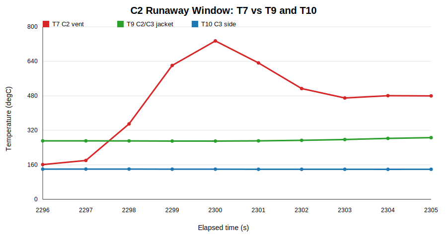
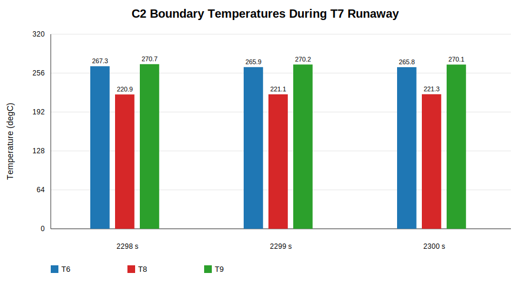
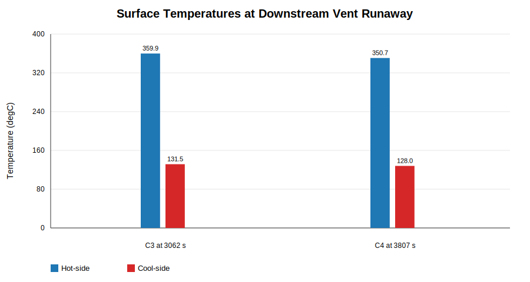
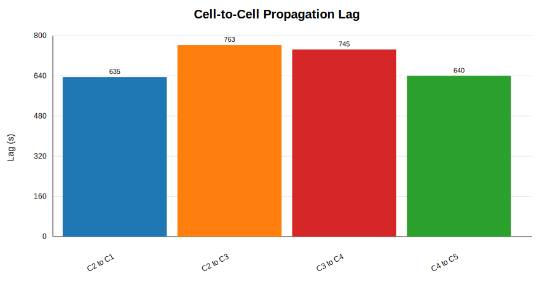
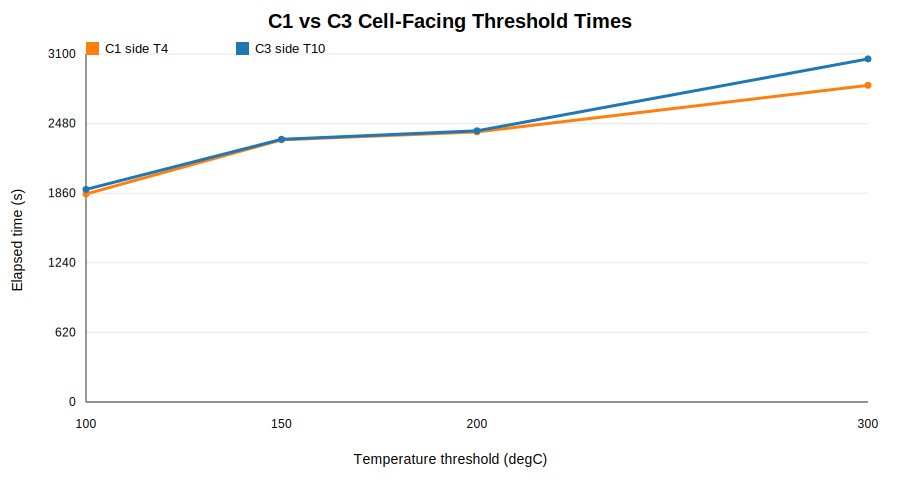
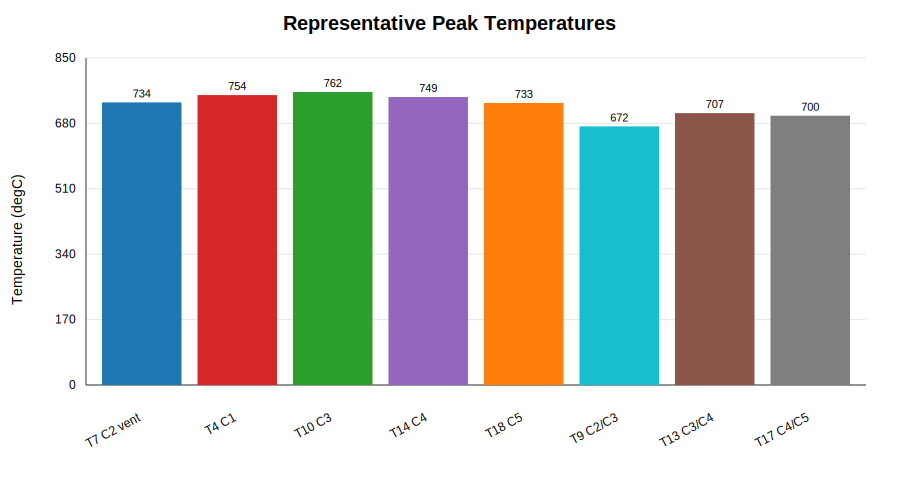

# Thermal Runaway Fire Test Data Analysis

## Data Basis

Only the raw timestamp column `A: Time` and thermocouple columns `F:AE` were used. Columns `B:E` were excluded because their derived time values conflict with the actual timestamp progression.

- Test start: 2025-11-25 14:55:53
- Test end: 2025-11-25 21:17:56
- Total duration: 22,923 s = 382.05 min = 6 h 22 min 03 s
- Data interval: 1.0 s/sample
- Data rows: 22,924

## Thermocouple Interpretation

Based on the test configuration image:

- C2 is the trigger cell. Heaters were applied directly to C2.
- No thermocouple was installed between the heater and C2 cell surface.
- T7 is on the C2 safety vent and is the main C2 runaway event marker.
- T6 and T8 are in contact with the C2 heater/insulation jacket area.
- T9 is between the C2 and C3 insulation jackets.
- T11, T15, and T19 are the vent thermocouples for C3, C4, and C5.

## Trigger Temperature Finding

C2 thermal runaway was identified by the sharp T7 vent temperature rise.

| Event marker | Elapsed time | Clock time | T7 value | Heating rate |
|---|---:|---:|---:|---:|
| First runaway excursion | 38 min 18 s | 15:34:11 | 349.6 °C | +169.3 °C/s |
| Maximum 1 s rise | 38 min 19 s | 15:34:12 | 620.8 °C | +271.2 °C/s |
| T7 peak | 38 min 20 s | 15:34:13 | 734.5 °C | - |

Conclusion: C2 entered thermal runaway at 38 min 18 s to 38 min 19 s from the first recorded timestamp.

Because there was no direct C2 heater-interface thermocouple, the C2 trigger temperature is inferred from nearby T6, T8, and T9.

| Time | T6 | T8 | T9 | Meaning |
|---:|---:|---:|---:|---|
| 38 min 18 s | 267.3 °C | 220.9 °C | 270.7 °C | T7 first runaway excursion |
| 38 min 19 s | 265.9 °C | 221.1 °C | 270.2 °C | T7 maximum 1 s rise |
| 38 min 20 s | 265.8 °C | 221.3 °C | 270.1 °C | T7 peak |

Conclusion: the inferred C2 trigger boundary temperature was about 221-271 °C. The hotter nearby readings were about 266-271 °C.

## Adjacent Cell Check

The C2/C3 interface and C3-side temperature stayed much lower than the C2 vent temperature during the first C2 runaway excursion.

| Elapsed time | T7 | T9 | T10 |
|---:|---:|---:|---:|
| 38 min 18 s | 349.6 °C | 270.7 °C | 140.2 °C |
| 38 min 19 s | 620.8 °C | 270.2 °C | 139.7 °C |
| 38 min 20 s | 734.5 °C | 270.1 °C | 139.8 °C |

This supports two points:

- C2 was already in runaway while the C3-side surface indicator T10 was only about 140 °C.
- T9 was about 270 °C at the C2 event, matching the inferred C2 trigger range.

C3 and C4 later confirmed the downstream failure trend.

| Cell | Vent runaway marker | Event time | Hot-side surface TC | Cool-side surface TC | Reading at event |
|---|---|---:|---|---|---|
| C3 | T11 | 51 min 02 s | T10 | T12 | T10 = 359.9 °C, T12 = 131.5 °C |
| C4 | T15 | 63 min 27 s | T14 | T16 | T14 = 350.7 °C, T16 = 128.0 °C |

C3 and C4 stayed dormant below about 300-325 °C at the hot-side surface. They entered runaway when the hot-side surface reached about 350-360 °C. This is an observed downstream failure threshold, not a safe design limit.

## Literature Check

The battery is identified as a CATL 117 Ah, 3.7 V lithium-ion cell. The CATL product specification describes it as ternary lithium chemistry, which is consistent with NMC/NCM-type chemistry.

Published NMC/NCM thermal-abuse studies commonly report thermal runaway trigger temperatures around 228-250 °C for comparable high-energy ternary cells. This agrees with the test result:

- Literature thermal-abuse trigger range: about 230-250 °C
- This test inferred C2 trigger range: about 221-271 °C
- Best engineering estimate for this test: C2 trigger occurred near 250-270 °C at the hotter nearby boundary locations

Overcharge literature can show lower apparent surface temperatures because the reaction starts internally. Those values should not be mixed directly with this external-heating propagation test.

## Dormant Temperature Limit

For design use, do not treat the observed 350-360 °C downstream failure threshold as safe. It is too close to runaway.

Recommended interpretation:

| Surface temperature | Engineering meaning |
|---:|---|
| Below 200 °C | Strong dormant region for external heating |
| 200-220 °C | Caution region; still likely stable but margin is reducing |
| 220-250 °C | High-risk transition region |
| Above 250 °C | Not safe; runaway may initiate depending on heating rate, SOC, and local hot spots |

Design target: keep adjacent cell surface below 200 °C during neighboring-cell runaway. Treat 220 °C as an upper warning limit, not a target.

## 200°C Timing Analysis

This section uses 200 °C as the key battery protection limit.

### C2 Above 200°C

C2 thermocouples used: T6, T7, and T8.

| Condition | Start | End | Duration |
|---|---:|---:|---:|
| First continuous period where T6/T7/T8 were all above 200 °C | 38 min 18 s | 47 min 40 s | 9 min 23 s |
| Second continuous period where T6/T7/T8 were all above 200 °C | 47 min 46 s | 188 min 22 s | 140 min 37 s |
| Total time where T6/T7/T8 were all above 200 °C | - | - | 150 min 00 s |

Conclusion: C2 entered runaway almost immediately after T6/T7/T8 were all above 200 °C. The first C2 runaway excursion happened at 38 min 18 s.

### Adjacent Cells Reaching 200°C

Using the first monitored thermocouple on each cell to reach 200 °C:

| Cell | First TC to reach 200 °C | Time |
|---|---|---:|
| C1 | T5 | 38 min 03 s |
| C3 | T10 | 40 min 16 s |
| C4 | T14 | 55 min 49 s |
| C5 | T18 | 67 min 55 s |

Using all monitored thermocouples around each cell above 200 °C:

| Cell | TCs checked | Time |
|---|---|---:|
| C1 | T3/T4/T5 | 48 min 44 s |
| C3 | T10/T11/T12/T13 | 52 min 57 s |
| C4 | T14/T15/T16/T17 | 65 min 56 s |
| C5 | T18/T19/T20/T21 | 74 min 50 s |

### 200°C Exposure Before Runaway

For adjacent cells, the most useful measure is hot-side surface exposure above 200 °C before vent runaway.

| Cell | Hot-side TC | 200 °C time | Runaway time | Exposure above 200 °C before runaway |
|---|---|---:|---:|---:|
| C3 | T10 | 40 min 16 s | 51 min 02 s | 10 min 46 s |
| C4 | T14 | 55 min 49 s | 63 min 27 s | 7 min 38 s |

Conclusion: after the adjacent cell hot-side surface reached 200 °C, runaway occurred after about 7 min 38 s to 10 min 46 s in this test.

C2 was directly heated, so it is not a clean adjacent-cell exposure case. Its nearby T8 crossed 200 °C at 37 min 05 s, and C2 runaway occurred at 38 min 19 s. That is only 1 min 14 s.

### Interval Between Cells Reaching 200°C

Using first thermocouple on each cell to reach 200 °C:

| Interval | Time gap |
|---|---:|
| C2 first 200 °C to C1 first 200 °C | 4 min 20 s |
| C2 first 200 °C to C3 first 200 °C | 6 min 33 s |
| C3 first 200 °C to C4 first 200 °C | 15 min 33 s |
| C4 first 200 °C to C5 first 200 °C | 12 min 06 s |

Using all monitored thermocouples around each cell above 200 °C:

| Interval | Time gap |
|---|---:|
| C2 all above 200 °C to C1 all above 200 °C | 10 min 26 s |
| C1 all above 200 °C to C3 all above 200 °C | 4 min 13 s |
| C3 all above 200 °C to C4 all above 200 °C | 12 min 59 s |
| C4 all above 200 °C to C5 all above 200 °C | 8 min 54 s |

### Material Effect From Heater Benchmark

The thermal runaway test used Cocoon FR Silicone. The heater benchmark shows how quickly each single-sheet material allowed the cold face T2 to reach 200 °C.

| Material | Time to T2 = 200 °C | Change vs Cocoon FR Silicone |
|---|---:|---:|
| Cocoon FR Silicone | 1 min 19 s | Baseline |
| Aerogel Ceramic Fiber | 0 min 49 s | 0 min 30 s faster |
| Aerogel Glass Fiber | 0 min 40 s | 0 min 39 s faster |
| Mica | 0 min 18 s | 1 min 01 s faster |
| 1360 Ceramic Fiber | 0 min 14 s | 1 min 05 s faster |

Conclusion: Cocoon FR Silicone was the best single-sheet material at delaying the cold face to 200 °C. However, it still reached 200 °C in only 1 min 19 s, far below the 12.5 min battery propagation target. A multilayer design is needed.

## Propagation Verification

The thermocouple data confirm that the C2 event was real and was followed by heat propagation. C1 does not have a dedicated vent thermocouple, so its event is marked from the strongest surface spike on T3. C5 is marked from the post-73 min T19 spike; the earlier T19 disturbance at 63 min 30 s is not treated as C5 thermal runaway because C5 surface thermocouples were still near 80-100 °C.

| Cell | Event TC | Event time | Clock time | Lag from C2 | Event signature |
|---|---|---:|---:|---:|---|
| C2 | T7 vent | 38 min 19 s | 15:34:12 | 0 min 00 s | 349.6 to 620.8 °C in 1 s |
| C1 | T3 surface | 48 min 54 s | 15:44:47 | 10 min 35 s | 332.1 to 384.9 °C in 1 s |
| C3 | T11 vent | 51 min 02 s | 15:46:55 | 12 min 43 s | 243.6 to 385.8 °C in 1 s |
| C4 | T15 vent | 63 min 27 s | 15:59:20 | 25 min 08 s | 254.4 to 453.8 °C in 1 s |
| C5 | T19 vent | 74 min 07 s | 16:10:00 | 35 min 48 s | 233.6 to 282.2 °C in 1 s; T19 reached 358.0 °C at 74 min 10 s |

Thermal lag:

- C2 to C1: 10 min 35 s
- C2 to C3: 12 min 43 s
- C3 to C4: 12 min 25 s
- C4 to C5: 10 min 40 s

Conclusion: the insulation delayed adjacent-cell propagation by about 10.5-12.7 min in the confirmed event sequence. It did not prevent cascade propagation.

## Heat Propagation and Asymmetry

Cell-facing threshold comparison around C2 shows uneven heat transfer.

| Threshold | C1-side T4 | C3-side T10 | C3 lag vs C1 |
|---:|---:|---:|---:|
| 100 °C | 30 min 53 s | 31 min 34 s | +0 min 41 s |
| 150 °C | 38 min 56 s | 39 min 00 s | +0 min 04 s |
| 200 °C | 40 min 06 s | 40 min 16 s | +0 min 10 s |
| 300 °C | 47 min 01 s | 50 min 56 s | +3 min 55 s |

Conclusion: early heating was similar on both sides of C2, but high-temperature propagation to C3 was slower than to C1. Barrier contact, geometry, or flame exposure was likely not symmetric.

## Peak Temperature and Stability Indicators

Representative peak temperatures:

| Location | TC | Peak temperature | Peak time |
|---|---|---:|---:|
| C2 vent | T7 | 734.5 °C | 38 min 20 s |
| C1 cell-facing / jacket region | T4 | 753.6 °C | 54 min 34 s |
| C3 cell-facing / jacket region | T10 | 761.7 °C | 58 min 55 s |
| C4 cell-facing / jacket region | T14 | 748.7 °C | 71 min 21 s |
| C5 cell-facing / jacket region | T18 | 733.1 °C | 82 min 17 s |
| C2/C3 inter-jacket | T9 | 672.2 °C | 59 min 09 s |
| C3/C4 inter-jacket | T13 | 706.7 °C | 71 min 50 s |
| C4/C5 inter-jacket | T17 | 699.9 °C | 82 min 40 s |

Inter-jacket and cell-facing locations reached 670-760 °C after propagation. This shows severe thermal exposure and loss of isolation after runaway gases and flame developed.

Outer/air-side peak temperatures were also high:

| TC | Peak temperature | Peak time |
|---|---:|---:|
| T1 | 519.0 °C | 62 min 13 s |
| T21 | 487.0 °C | 90 min 39 s |
| T22 | 221.6 °C | 74 min 29 s |
| T23 | 238.6 °C | 79 min 17 s |
| T24 | 281.2 °C | 74 min 13 s |
| T25 | 228.0 °C | 102 min 27 s |

Conclusion: the jacket did not maintain low external temperature during the event. Possible causes include flame exposure, leakage paths, insulation shrinkage, cracking, or thermocouple exposure after structural movement.

## Failure Mechanisms

Most likely mechanisms:

- C2 thermal runaway started at the heater-loaded cell.
- T7 detected venting sharply and is the best event marker.
- Heat moved through both adjacent interfaces, but the path was not symmetric.
- The insulation delayed propagation but was later overwhelmed by vent gas, flame, and high heat flux.
- The early C5 T19 disturbance at 63 min 30 s suggests hot-gas or flame exposure from the C4 event, but the stronger C5 thermal runaway marker occurs later at about 74 min 07 s to 74 min 10 s.

## Experimental and Data Quality Issues

- Columns `B:E` contain an incorrect time base and must not be used for timing.
- The raw timestamp interval is 1 s, so sub-second event timing cannot be resolved.
- No direct thermocouple was installed between the heater and C2 cell surface.
- T7/T11/T15/T19 are good vent-event markers, but after venting they may read flame/gas temperature rather than cell body temperature. C1 was marked from T3 because no dedicated C1 vent TC was available.
- Sharp 1 s jumps are consistent with vent flame exposure, but TC movement or direct flame impingement may also contribute.

## Actionable Recommendations

1. Add a C2 cell-surface thermocouple at the heater interface, or as close as possible.
2. Add duplicate thermocouples at key interfaces to detect TC detachment or flame impingement.
3. Correct the data export template so elapsed time is calculated from raw timestamps.
4. Increase acquisition rate to at least 10 Hz during trigger testing.
5. Add post-test photos and insulation condition checks to link temperature spikes with cracking, shrinkage, or burn-through.
6. Improve barrier edge sealing and vent-gas control.
7. Repeat the test to confirm whether the 12.5 min propagation delay is repeatable.

## Product Design Conclusion

The inferred battery thermal runaway trigger temperature is about 221-271 °C from this test. The best practical estimate is near 250-270 °C at the hotter nearby boundary points. Literature for similar NMC/NCM cells supports a trigger range of about 230-250 °C.

For product design, use a safer limit than the trigger temperature:

- Target protected-side battery surface: below 200 °C
- Warning limit: 200-220 °C
- High-risk zone: above 220 °C
- Do not treat 350-360 °C as safe. This was the observed downstream failure threshold, not a design limit.

The critical propagation duration from this test is about 10.5-12.7 min. C2-to-C1 propagation took 10 min 35 s, C2-to-C3 propagation took 12 min 43 s, C3-to-C4 propagation took 12 min 25 s, and C4-to-C5 propagation took 10 min 40 s using the revised C5 marker.

Product design target:

- The insulation sheet should keep the adjacent battery-side surface below 200 °C for at least 12.5 min, with awareness that the shortest observed propagation interval in this test was about 10.5 min.
- A stronger development target is below 200 °C for 15 min under severe hot-face exposure.
- Record whether the cold face reaches 200 °C, 220 °C, and 250 °C. These are more useful than only recording final temperature.

## Heater Benchmark Findings and Next Steps

The heater benchmark test is a useful screening method for battery insulation sheets. It is not a full battery thermal runaway test, but it can compare insulation materials under severe contact heating.

The heater setup used:

- Heater controller setpoint: 900 °C
- Actual stabilized hot zone: about 845-850 °C
- T1: hot-face/sample interface
- T2: cold-face/sample underside
- Test duration: 30 min

This hot-face condition is adequate for screening. It is close to or more severe than many temperatures seen during the battery propagation test. The test specification should be based on measured T1, not controller setpoint.

Recommended heater benchmark condition:

- Measured T1 hot face: 800-850 °C
- Key check time: 12.5 min
- Preferred margin check time: 15 min
- Main pass target: T2 below 200 °C at 12.5 min
- Warning zone: T2 between 200-220 °C
- Fail / high-risk zone: T2 above 220 °C

Summary of current heater benchmark results:

| Material | Thickness | T2 at 30 min | Time to T2 = 200 °C | Fire observation | Comment |
|---|---:|---:|---:|---|---|
| Aerogel Ceramic Fiber | 2.0 mm | 534.2 °C | 0 min 49 s | Ignition at 0 min 20 s to 0 min 30 s | Best thermal delay, weak fire stability |
| Cocoon FR Silicone | 2.7 mm | 535.3 °C | 1 min 19 s | Ignition at 1 min 40 s to 2 min 00 s | Best delay to 200 °C, practical candidate |
| Aerogel Glass Fiber | 2.0 mm | 577.7 °C | 0 min 40 s | Ignition at 0 min 05 s to 0 min 10 s | Medium insulation, early ignition |
| Mica | 1.0 mm | 653.2 °C | 0 min 18 s | No ignition | Fire-stable facing, poor insulation alone |
| 1360 Ceramic Fiber | 1.0 mm | 654.3 °C | 0 min 14 s | Ignition at 0 min 05 s to 0 min 10 s | Not enough insulation as tested |

Current benchmark result: none of the tested single-sheet samples kept the cold face below the 200 °C protected-side target for long enough. The best sample reached 200 °C in 1 min 19 s, far below the 12.5 min target.

Next iteration should focus on multilayer designs:

- Use mica or another non-combustible facing on the hot side for flame and electrical stability.
- Add aerogel ceramic fiber or silicone-based insulation behind the facing for thermal resistance.
- Increase thickness or reduce compression if packaging allows.
- Improve edge sealing to reduce hot-gas bypass.
- Test at least three repeats per design.
- Log T0/T1/T2 together from before sample insertion to cooldown.
- Use T2 at 12.5 min and 15 min as the main battery-protection metrics.

Future pass/fail target:

- Pass: T2 below 200 °C at 12.5 min under 800-850 °C measured T1 exposure.
- Strong pass: T2 below 200 °C at 15 min.
- Fail: T2 above 220 °C before 12.5 min, visible burn-through, severe cracking, collapse, or sustained flame spread.

